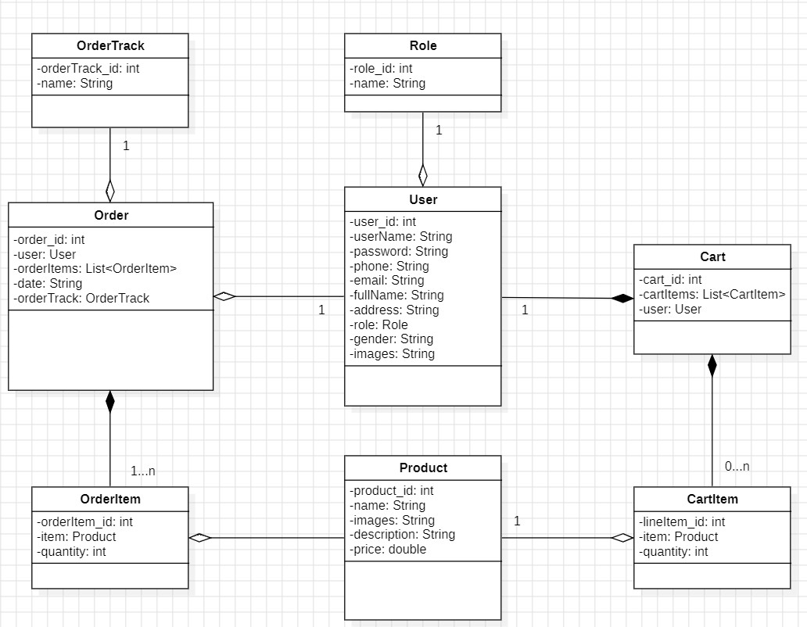

# Book Store API

Experience a smooth and efficient online book shopping experience with our Book Store API, built using Java, Spring Boot, and MySQL, leveraging RESTful API architecture for robust backend management and seamless data handling

## Table of Contents

1. [Class Diagram](#class-diagram)
1. [Prerequisites](#prerequisites)
1. [Installation](#installation)
1. [Technology Stack](#technology-stack)
1. [Usage](#usage)
1. [Author](#author)
1. [License](#license)
1. [References](#references)

## Class Diagram



## Prerequisites

- Java Development Kit (JDK) 21 or later
- Maven: 3.9.8
- Spring Boot: 3.3.2

## Installation

1. Clone the project from the repository:

    ```sh
    git clone https://github.com/nguyenkhanhquy/bookstore-api.git
    ```

2. Adjust configurations if necessary.

3. Run the application:

    ```sh
    mvn spring-boot:run
    ```

## Technology Stack

- Programming Language: Java
- Frameworks/Libraries: Spring Framework, Spring Boot, Spring Data JPA, Hibernate
- Database: MySQL
- IDE: IntelliJ IDEA
- Deployment: Heroku
- Cloud Storage: AWS S3

## Usage

Instructions on how to use the API and interact with its endpoints

### Resources

- [`https://api.21110282.codes/swagger-ui.html`](https://api.21110282.codes/swagger-ui.html) : API documentation and testing

### Endpoints

- `GET /api/v1/products` : Get a list of products
- `GET /api/v1/products/{productId}` : Get product information by ID
- `POST /api/v1/products` : Create a new product
- `PUT /api/v1/products/{productId}` : Update product information
- `DELETE /api/v1/products/{productId}` : Delete a product
- . . .

## Author

- Author Name: `Nguyễn Khánh Quy`
- Email: <nguyenkhanhquy123@gmail.com>

## License

This project is licensed under the MIT License - see the [LICENSE](https://github.com/nguyenkhanhquy/bookstore-api/blob/main/LICENSE) file for details

## References

- [Project Book APP](https://github.com/nguyenkhanhquy/bookstore-app)
